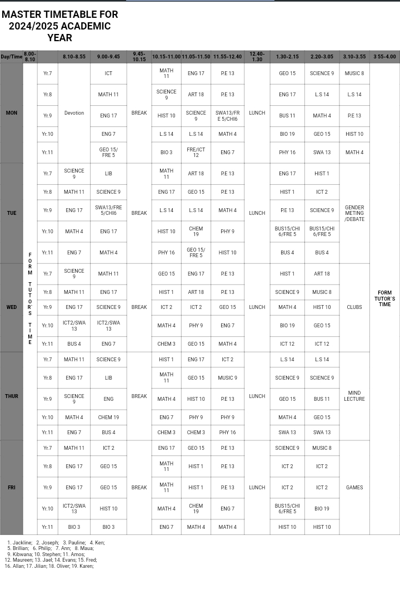

# Master Timetable for 2024/2025 Academic Year

## Description
This project is designed to display a **master timetable** using HTML and CSS. It organizes class schedules for each day of the week, ensuring clarity and accessibility. 

## Contents
- **`index.html`**: The main HTML file containing the timetable structure.
- **`styles.css`**: The external CSS file used for styling the webpage.
- **`timetable_preview.png`**: A preview image showing how the timetable looks.
- **`README.md`**: This markdown file, which provides project details and instructions.

## Screenshots

_This screenshot shows the table layout as displayed in the browser._

## Instructions
1. Open the `index.html` file in any modern web browser to view the timetable.
2. Ensure that `styles.css` is located in the same directory as `index.html` for proper styling.
3. Refer to `timetable_preview.png` for a visual representation of the timetable layout.

## Additional Notes
- This project demonstrates the use of HTML and CSS to create a functional and visually appealing design.
- The timetable has been tested in modern browsers and works seamlessly across devices.

## Author Information:
- Created by: LEWIS MWILITSA. 
- EmailAddress: Lewismwilitsa00@gmail.com 